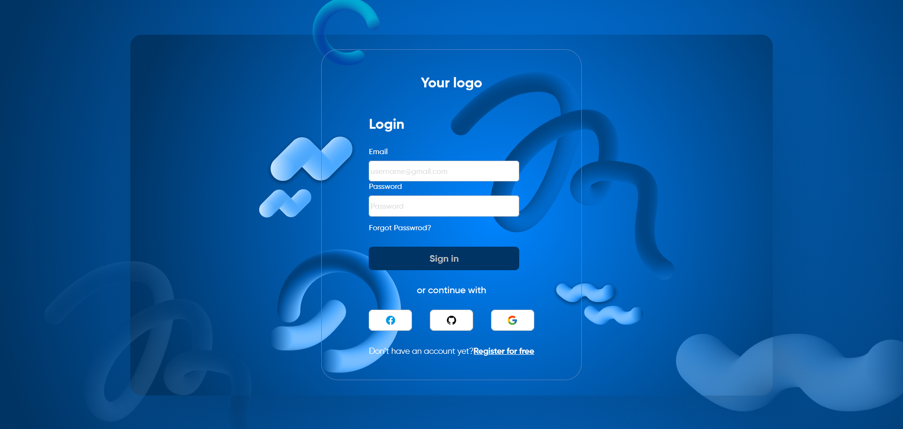

# 🔐 Login Page Template

A simple and responsive **Login Page** built with **HTML** and **CSS**.  
This template can be used as a starting point for authentication pages in your projects. 🚀

---

## ✨ Features
✅ Clean and modern design  
✅ Easy to customize and integrate  
✅ Pure **HTML + CSS** (no frameworks required)  

---

## ⚙️ Installation & Usage

### 1️⃣ Clone the repository
```bash
git clone https://github.com/YourUsername/Login-Page-Template.git
cd Login-Page-Template
```

### 2️⃣ Open in browser
Simply open the `index.html` file in your browser:
```bash
open index.html
```
or just **double-click** on it.

---

## 📸 Screenshot



---

## 📦 Technologies Used
- HTML5 🌐  
- CSS3 🎨  

---

## 🤝 Contributing
Contributions are welcome!  
Feel free to fork the repo, open a **Pull Request**, or suggest ideas in the **Issues** section. 💡
